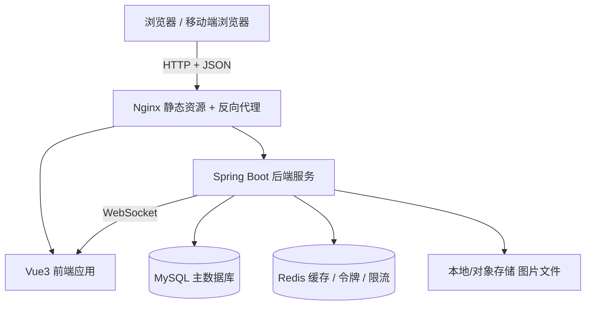

# 基于 Java 的校园闲置物品交易平台
## 需求规格说明书（SRS）

> 技术栈：Spring Boot（后端） + Vue（前端） + MySQL（数据库）
> 文档版本：V1.0
> 说明：本文档为毕业设计开题/需求分析阶段产物，可直接用于开题报告、任务书与论文"需求分析"章节。

---

## 一、项目概述

### 1.1 项目背景

校园是典型的"高流动性 + 高闲置率"场景：学生每学期都会产生大量使用率极低的物品——教材与考研资料、数码配件、自行车与电动车、宿舍小家电、文体用品、化妆品、演出与运动装备等。毕业季、换季、搬家时这些物品大量被丢弃或低价处理，资源浪费严重。

同时，校园二手交易目前主要依赖以下渠道，且都存在明显短板：

| 现有渠道 | 主要问题 |
|---|---|
| 微信群 / QQ 群 | 消息刷屏快、无搜索、无有效期、交易全靠私聊、无信用记录 |
| 闲鱼等社会平台 | 面向社会用户，同校匹配难、当面交易不便、需实名认证、抽佣与纠纷成本高 |
| 校园墙 / 表白墙投稿 | 人工代发、效率低、信息不规范、无法跟踪交易 |
| 线下跳蚤市场 | 时间地点受限、频次极低 |

因此，建设一个**只面向本校学生、以当面交易为主、信息结构化、带信用与评价体系**的校园闲置物品交易平台，具有明确的实用价值。

### 1.2 项目目标

构建一个基于 B/S 架构的校园 C2C 闲置物品交易平台，实现：

1. **信息发布结构化**：物品信息（分类、成色、价格、图片、交易地点）标准化，可搜索、可筛选、可排序。
2. **交易流程线上化**：从"浏览 → 咨询 → 下单 → 支付/当面交易 → 确认收货 → 评价"形成闭环，订单状态可追踪。
3. **信用体系可视化**：通过评价、成交记录、举报记录建立用户信用分，降低交易风险。
4. **社区管理规范化**：管理员可审核商品、处理举报、管理用户与分类，保障平台健康运行。
5. **技术实践完整化**：完整体现 Java 后端工程能力（分层架构、鉴权、缓存、并发控制）与前后端分离开发能力。

### 1.3 系统范围

- **包含**：用户注册登录、商品发布与检索、收藏、聊天咨询、订单交易、模拟支付、评价、举报、后台管理。
- **不包含**（论文中说明为"后续工作"）：真实第三方支付对接、物流配送、跨校/社会用户开放、直播带货、广告投放系统。
- **交易方式定位**：以**校园当面交易**为主（下单后约定地点当面交付），可选邮寄。

---

## 二、用户角色与权限

| 角色 | 说明 | 主要权限 |
|---|---|---|
| **游客** | 未登录访问者 | 浏览商品列表/详情、搜索筛选、查看卖家主页与评价 |
| **注册用户** | 通过学号/邮箱或手机号注册的学生，兼具买家与卖家身份 | 发布/编辑/下架商品、收藏、聊天、下单、支付、确认收货、评价、举报、查看个人订单与信用 |
| **管理员** | 平台运营与管理人员 | 商品审核与强制下架、用户冻结/解封、分类管理、举报处理、订单纠纷仲裁、数据统计看板、公告管理 |

> 说明：本平台不设独立"卖家"角色，同一用户既可以是买家也可以是卖家，这是 C2C 模式的典型特征，也与闲鱼等主流平台一致。

### 权限矩阵（节选）

| 功能 | 游客 | 注册用户 | 管理员 |
|---|---|---|---|
| 浏览商品 | ✅ | ✅ | ✅ |
| 搜索筛选 | ✅ | ✅ | ✅ |
| 发布商品 | ❌ | ✅ | ✅ |
| 收藏 | ❌ | ✅ | — |
| 聊天咨询 | ❌ | ✅ | — |
| 下单购买 | ❌ | ✅ | — |
| 审核商品 | ❌ | ❌ | ✅ |
| 处理举报 | ❌ | ❌ | ✅ |
| 数据统计 | ❌ | ❌ | ✅ |

---

## 三、功能性需求

系统功能划分为 **7 个模块**：用户模块、商品模块、交易模块、互动模块、信用与风控模块、后台管理模块、统计模块。

### 3.1 用户模块（FR-1）

| 编号 | 需求描述 | 优先级 |
|---|---|---|
| FR-1.1 | 支持用户注册，注册信息包括昵称、手机号/邮箱、学号、密码；密码需加密存储（BCrypt） | 高 |
| FR-1.2 | 支持学号或手机号登录，登录成功后签发 JWT 令牌 | 高 |
| FR-1.3 | 支持修改个人资料：头像、昵称、性别、校区/宿舍区、联系方式、个性签名 | 高 |
| FR-1.4 | 支持修改密码、退出登录 | 中 |
| FR-1.5 | 支持查看他人主页：在售商品、成交数、评价、信用分 | 中 |
| FR-1.6 | 支持头像上传与图片压缩 | 中 |
| FR-1.7 | 支持找回密码（邮箱验证码 / 密保问题，可模拟） | 低 |

**业务规则**

- 学号在同一学校范围内唯一，重复注册需提示。
- 昵称长度 2–12 字符，不允许包含敏感词。
- 未登录用户不能访问收藏、订单、聊天等个人中心页面，需跳转登录。

### 3.2 商品模块（FR-2）

| 编号 | 需求描述 | 优先级 |
|---|---|---|
| FR-2.1 | 用户可发布商品：标题、分类、成色、价格（原价/现价）、描述、图片（1–9 张）、交易地点、交易方式 | 高 |
| FR-2.2 | 支持商品分类两级结构（如：数码 → 手机配件），分类由管理员维护 | 高 |
| FR-2.3 | 支持商品列表分页展示，支持按分类、价格区间、成色、校区、交易方式筛选 | 高 |
| FR-2.4 | 支持关键词搜索（标题 + 描述），支持按时间/价格/热度排序 | 高 |
| FR-2.5 | 支持商品详情页展示：图片轮播、卖家信息、浏览量、收藏数、同类推荐 | 高 |
| FR-2.6 | 卖家可编辑、下架、上架、删除自己的商品 | 高 |
| FR-2.7 | 商品发布后进入待审核状态，管理员审核通过后才在前台展示（可配置是否免审核） | 中 |
| FR-2.8 | 商品售出后自动标记为"已售出"并从前台列表移除 | 中 |
| FR-2.9 | 支持商品收藏与取消收藏，支持在个人中心查看收藏夹 | 中 |
| FR-2.10 | 支持商品状态自动管理：超期未售（如 60 天）自动下架并提醒卖家 | 低 |

**商品状态定义**

```
待审核(0) → 在售(1) → 交易中(2) → 已售出(3)
                ↓
           已下架(4) / 审核不通过(5)
```

**业务规则**

- 现价必须大于 0 且不高于原价（若填写原价）。
- 一件在售商品同时只能对应一个有效订单，下单后该商品状态变为"交易中"，其他人不可再下单——**该规则需要并发控制**（见 FR-3.4）。
- 每人每天发布商品数量上限（如 20 件），防止刷屏。

### 3.3 交易模块（FR-3）

| 编号 | 需求描述 | 优先级 |
|---|---|---|
| FR-3.1 | 买家可在商品详情页点击"立即购买"，生成订单 | 高 |
| FR-3.2 | 订单信息包括：订单号、商品快照（标题/图片/价格）、买卖双方、金额、交易地点、交易方式、备注 | 高 |
| FR-3.3 | 订单状态流转：待付款 → 待发货/待面交 → 待收货 → 已完成 / 已取消 | 高 |
| FR-3.4 | 下单时对商品加锁（乐观锁或 Redis 分布式锁），避免同一商品被多人重复下单 | 高 |
| FR-3.5 | 支持买家取消订单（未支付时），支持卖家在约定时间未成交时关闭订单 | 高 |
| FR-3.6 | 支持模拟支付（本地钱包/支付宝沙箱），支付成功后订单进入待收货状态 | 中 |
| FR-3.7 | 买家确认收货后订单完成，商品标记为已售出 | 高 |
| FR-3.8 | 订单超时未支付自动取消（如 30 分钟），商品恢复在售状态 | 中 |
| FR-3.9 | 买家和卖家均可查看"我买到的/我卖出的"订单列表，支持按状态筛选 | 高 |
| FR-3.10 | 支持订单详情页查看交易双方联系方式与聊天入口 | 中 |
| FR-3.11 | 支持申请退款/纠纷发起，交由管理员仲裁（简化流程） | 低 |

**订单状态机**

```
待付款(PENDING_PAY)
   ├─ 支付成功 → 待收货(WAIT_RECEIVE) ──确认收货──→ 已完成(COMPLETED)
   ├─ 用户取消 → 已取消(CANCELLED)
   └─ 超时30min → 自动取消(AUTO_CANCELLED)

待收货期间：买家可申请退款 → 退款中(REFUNDING) → 管理员仲裁 → 已退款/已驳回
```

**业务规则**

- 订单号生成规则：日期 + 随机数（如 `20260915` + 8 位随机），保证唯一且可读。
- 已完成订单才允许评价。
- 订单完成后不可删除，仅可关闭展示（用于数据追溯）。

### 3.4 互动模块（FR-4）

| 编号 | 需求描述 | 优先级 |
|---|---|---|
| FR-4.1 | 买家可在商品详情页向卖家发起聊天咨询，支持文字消息 | 高 |
| FR-4.2 | 支持消息列表（会话列表）、未读消息数提示 | 中 |
| FR-4.3 | 支持 WebSocket 实时推送消息（或轮询方案降级） | 中 |
| FR-4.4 | 支持消息已读/未读状态标记 | 低 |
| FR-4.5 | 商品详情页支持留言/问答区（可选，与私聊二选一） | 低 |

> 实现建议：聊天功能是本项目最具"技术含量"的模块之一，建议采用 **WebSocket + 消息持久化（MySQL）**，并说明离线消息拉取策略，可在论文中作为重点章节。

### 3.5 信用与风控模块（FR-5）

| 编号 | 需求描述 | 优先级 |
|---|---|---|
| FR-5.1 | 交易完成后买卖双方可互相评价：星级（1–5）+ 文字评价 | 高 |
| FR-5.2 | 评价不可修改、不可删除（可申请管理员删除违规评价） | 中 |
| FR-5.3 | 系统根据评价计算用户信用分（如满分 100，初始 80，五星 +2，一星 −5） | 中 |
| FR-5.4 | 用户主页展示信用分、好评率、成交笔数 | 中 |
| FR-5.5 | 任何用户可对违规商品/用户发起举报，填写举报理由与证据图片 | 中 |
| FR-5.6 | 信用分低于阈值（如 40）时限制发布商品，并提示整改 | 低 |
| FR-5.7 | 记录敏感操作日志（登录、发布、下架、冻结）用于追溯 | 低 |

### 3.6 后台管理模块（FR-6）

| 编号 | 需求描述 | 优先级 |
|---|---|---|
| FR-6.1 | 管理员登录（独立登录入口与权限拦截） | 高 |
| FR-6.2 | 商品管理：列表查询、按状态/关键词筛选、审核通过/驳回、强制下架 | 高 |
| FR-6.3 | 用户管理：列表查询、查看详情、冻结/解封账号 | 高 |
| FR-6.4 | 分类管理：新增、编辑、删除、排序（两级分类） | 高 |
| FR-6.5 | 举报管理：查看举报详情、处理（驳回/下架商品/封号） | 中 |
| FR-6.6 | 订单管理：查询订单、处理退款仲裁 | 中 |
| FR-6.7 | 公告管理：发布/编辑/删除平台公告，前台首页轮播展示 | 低 |
| FR-6.8 | 评价管理：查看并删除违规评价 | 低 |

### 3.7 统计模块（FR-7）

| 编号 | 需求描述 | 优先级 |
|---|---|---|
| FR-7.1 | 首页数据看板：用户总数、商品总数、在售数、订单总数、成交金额 | 中 |
| FR-7.2 | 商品分类占比统计（饼图） | 中 |
| FR-7.3 | 近 7 / 30 日订单量与成交额趋势（折线图） | 中 |
| FR-7.4 | 热门商品 Top 10（按浏览量/收藏量） | 低 |

> 前端图表建议使用 **ECharts**，该模块是答辩时的直观加分项。

---

## 四、非功能性需求

### 4.1 性能需求

| 指标 | 要求 |
|---|---|
| 普通页面响应时间 | ≤ 2 秒（局域网环境≤200ms） |
| 商品列表接口 | 单次查询 ≤ 500ms，支持 10 万级商品数据分页 |
| 并发能力 | 支持 ≥ 100 并发用户正常访问（JMeter 压测验证） |
| 图片加载 | 缩略图 ≤ 200KB，原图懒加载 |
| 缓存 | 热点数据（分类、首页、商品详情）使用 Redis 缓存，命中率 ≥ 70% |

### 4.2 安全需求

1. **认证与授权**：JWT + Spring Security，接口按角色鉴权；管理员接口单独前缀（如 `/api/admin/**`）并双重拦截。
2. **密码安全**：BCrypt 加盐哈希，禁止明文存储与日志输出。
3. **SQL 注入防护**：使用 MyBatis-Plus / 预编译语句，禁止字符串拼接 SQL。
4. **XSS 防护**：富文本与商品描述做 HTML 转义或白名单过滤。
5. **CSRF / 越权**：校验请求来源，接口层校验资源归属（如"只能改自己的商品"）。
6. **文件上传**：校验文件类型与大小，重命名存储，限制可执行脚本类型。
7. **接口限流**：登录、发送消息、发布商品等接口做频率限制（Redis + 令牌桶）。
8. **敏感信息**：手机号、联系方式在列表中脱敏展示。

### 4.3 可靠性需求

- 关键操作（下单、支付回调、确认收货）使用数据库事务保证一致性。
- 系统异常统一捕获并由全局异常处理器返回规范错误码，不向前端暴露堆栈。
- 数据库定期备份（每日全量 + 增量）。

### 4.4 易用性与兼容性需求

- 界面简洁，符合学生用户使用直觉；关键操作有二次确认与结果提示。
- 支持 Chrome / Edge / Firefox 主流浏览器最新两个版本。
- 支持响应式布局，移动端浏览器可正常浏览与下单（不低于 375px 宽度）。

### 4.5 可维护性与可扩展性需求

- 后端采用分层架构：`Controller → Service → Mapper → DB`，职责清晰。
- 统一返回体 `Result<T>`、统一错误码、统一分页对象。
- 接口遵循 RESTful 风格，预留版本号（`/api/v1/...`）。
- 配置外置（`application-dev.yml` / `application-prod.yml`），便于部署切换。

---

## 五、技术架构

### 5.1 总体架构

采用 **前后端分离的 B/S 架构**，前端通过 HTTP/JSON 调用后端 REST 接口。



### 5.2 技术选型

| 层次 | 技术 | 选型理由 |
|---|---|---|
| 后端框架 | Spring Boot 3.x | 自动配置、生态成熟、毕设主流 |
| 持久层 | MyBatis-Plus | CRUD 高效、支持分页与乐观锁插件 |
| 安全 | Spring Security + JWT | 无状态鉴权，适配前后端分离 |
| 缓存 | Redis | 缓存热点数据、Token 黑名单、限流、分布式锁 |
| 数据库 | MySQL 8.0 | 关系型、稳定、支持事务与窗口函数 |
| 实时通信 | WebSocket (Spring WebSocket) | 聊天消息实时推送 |
| 前端框架 | Vue 3 + Vite | 组合式 API、构建快 |
| UI 组件 | Element Plus | 后台与表单开发效率高 |
| 状态管理 | Pinia | 轻量、替代 Vuex |
| 路由 | Vue Router 4 | 前端路由与权限守卫 |
| 图表 | ECharts | 统计看板可视化 |
| 接口文档 | Knife4j / Swagger | 自动生成接口文档，便于联调与答辩演示 |
| 部署 | Linux + Nginx + JDK17 + MySQL + Redis | 常见生产组合 |

### 5.3 后端分层结构（建议）

```
com.campus.trade
├── common          // 统一返回体、异常、常量、工具类
├── config          // Security、Redis、WebSocket、Knife4j 配置
├── controller      // 接口层
├── service         // 业务逻辑层（接口 + 实现）
├── mapper          // 持久层接口
├── entity          // 数据库实体
├── dto / vo        // 传输对象与视图对象
├── interceptor     // 登录与权限拦截器
└── task            // 定时任务（订单超时、商品超期下架）
```

### 5.4 前端工程结构（建议）

```
src
├── api             // 接口封装（axios）
├── assets
├── components      // 公共组件（商品卡片、分页、图片上传）
├── router          // 路由与权限守卫
├── store           // Pinia 状态（用户、购物/收藏）
├── utils           // 请求拦截、格式化、校验
├── views
│   ├── home        // 首页
│   ├── goods       // 商品列表 / 详情 / 发布
│   ├── order       // 订单
│   ├── chat        // 聊天
│   ├── user        // 个人中心
│   └── admin       // 后台管理
└── main.js
```

---

## 六、数据库设计概要

### 6.1 核心数据表

| 表名 | 说明 | 关键字段 |
|---|---|---|
| `t_user` | 用户表 | id、学号、昵称、手机号、密码、头像、校区、信用分、状态、创建时间 |
| `t_category` | 商品分类表 | id、父id、名称、排序、状态 |
| `t_goods` | 商品表 | id、卖家id、分类id、标题、描述、原价、现价、成色、交易地点、状态、浏览量、收藏量、创建时间 |
| `t_goods_image` | 商品图片表 | id、商品id、图片url、排序 |
| `t_favorite` | 收藏表 | id、用户id、商品id、创建时间（用户+商品唯一索引） |
| `t_order` | 订单表 | id、订单号、商品id、买家id、卖家id、金额、状态、交易方式、交易地点、创建时间、支付时间、完成时间 |
| `t_payment` | 支付记录表 | id、订单号、支付流水号、金额、支付方式、状态、支付时间 |
| `t_message` | 聊天消息表 | id、会话id、发送者id、接收者id、内容、类型、是否已读、创建时间 |
| `t_conversation` | 会话表 | id、商品id、用户A、用户B、最后一条消息、更新时间 |
| `t_review` | 评价表 | id、订单id、评价人id、被评价人id、星级、内容、创建时间 |
| `t_report` | 举报表 | id、举报人id、目标类型、目标id、理由、证据图片、状态、处理结果 |
| `t_credit_log` | 信用分变更日志 | id、用户id、变更值、原因、关联订单 |
| `t_announcement` | 公告表 | id、标题、内容、状态、发布时间 |
| `t_admin` | 管理员表 | id、账号、密码、角色、状态 |
| `t_operate_log` | 操作日志表 | id、操作人、操作类型、目标、IP、时间 |

### 6.2 关键约束与索引

- `t_goods` 建索引：`(status, category_id, create_time)`、`title`（全文或前缀索引）。
- `t_order` 建唯一索引：`order_no`；建索引：`(buyer_id, status)`、`(seller_id, status)`。
- `t_favorite` 建唯一索引：`(user_id, goods_id)`。
- `t_review` 建唯一索引：`(order_id, reviewer_id)`，防止重复评价。
- 商品价格使用 `DECIMAL(10,2)`，禁止使用 `FLOAT`。
- 时间字段统一 `DATETIME`，创建/更新时间自动维护。

### 6.3 并发控制要点（答辩重点）

同一商品被多人同时下单时，采用以下任一方案避免超卖：

1. **乐观锁**：`t_goods` 增加 `version` 字段，`UPDATE ... WHERE id=? AND status=1 AND version=?`，影响行数为 0 则下单失败。
2. **Redis 分布式锁**：以商品 id 为 key，获取锁成功后执行下单逻辑。
3. **数据库悲观锁**：`SELECT ... FOR UPDATE`（并发量不大时最简单）。

> 论文中建议对比三种方案的优劣并说明最终选择，这是很好的"技术深度"体现。

---

## 七、接口设计规范

### 7.1 统一返回体

```json
{
  "code": 200,
  "msg": "操作成功",
  "data": { }
}
```

| 状态码 | 含义 |
|---|---|
| 200 | 成功 |
| 400 | 参数校验失败 |
| 401 | 未登录 / Token 失效 |
| 403 | 无权限 |
| 404 | 资源不存在 |
| 500 | 服务器异常 |
| 1001 | 业务异常（商品已售出等） |

### 7.2 接口清单（节选）

| 模块 | 方法 | 路径 | 说明 |
|---|---|---|---|
| 用户 | POST | `/api/v1/auth/register` | 注册 |
| 用户 | POST | `/api/v1/auth/login` | 登录 |
| 用户 | GET | `/api/v1/user/profile` | 获取个人信息 |
| 用户 | PUT | `/api/v1/user/profile` | 修改资料 |
| 商品 | GET | `/api/v1/goods` | 商品分页列表（含筛选） |
| 商品 | GET | `/api/v1/goods/{id}` | 商品详情 |
| 商品 | POST | `/api/v1/goods` | 发布商品 |
| 商品 | PUT | `/api/v1/goods/{id}` | 编辑商品 |
| 商品 | PUT | `/api/v1/goods/{id}/off` | 下架商品 |
| 收藏 | POST | `/api/v1/favorite/{goodsId}` | 收藏 |
| 订单 | POST | `/api/v1/orders` | 创建订单 |
| 订单 | GET | `/api/v1/orders` | 我的订单 |
| 订单 | PUT | `/api/v1/orders/{id}/cancel` | 取消订单 |
| 订单 | PUT | `/api/v1/orders/{id}/confirm` | 确认收货 |
| 支付 | POST | `/api/v1/pay/{orderId}` | 发起支付 |
| 评价 | POST | `/api/v1/reviews` | 提交评价 |
| 举报 | POST | `/api/v1/reports` | 提交举报 |
| 聊天 | GET | `/api/v1/conversations` | 会话列表 |
| 聊天 | GET | `/api/v1/conversations/{id}/messages` | 消息记录 |
| 管理 | GET | `/api/v1/admin/goods` | 商品审核列表 |
| 管理 | PUT | `/api/v1/admin/goods/{id}/audit` | 审核商品 |
| 管理 | PUT | `/api/v1/admin/users/{id}/status` | 冻结/解封用户 |
| 管理 | GET | `/api/v1/admin/statistics` | 数据看板 |

---

## 八、核心用例（简述）

**用例 1：发布商品**
1. 用户登录后进入"发布闲置"页面；
2. 填写标题、分类、成色、价格、描述，上传 1–9 张图片，选择交易地点；
3. 前端校验（必填、价格、图片数量与大小）；
4. 提交后后端保存商品，状态为"待审核"；
5. 管理员审核通过后，商品在列表页展示；
6. 系统记录发布日志，用户可在"我的发布"中查看状态。

**用例 2：购买商品**
1. 买家浏览/搜索商品，进入详情页；
2. 点击"立即购买"，系统校验商品是否仍在售；
3. 生成订单（状态：待付款），商品状态改为"交易中"（加锁）；
4. 买家支付（模拟），订单变为"待收货"；
5. 双方当面交付后，买家确认收货，订单变"已完成"，商品变"已售出"；
6. 双方互评，信用分更新。

**用例 3：处理举报**
1. 用户举报违规商品并上传证据；
2. 举报进入待处理列表；
3. 管理员查看详情，判定成立则下架商品并警告/冻结卖家；
4. 处理结果通知举报人与被举报人。

---

## 九、项目难点与创新点

### 9.1 技术难点

1. **商品下单并发控制**（防止一件商品被多人同时购买）。
2. **订单状态机的完整性与一致性**（状态流转合法校验、超时自动取消）。
3. **WebSocket 实时聊天**（连接管理、离线消息、未读数统计）。
4. **前后端分离下的鉴权设计**（JWT 无状态鉴权 + 路由守卫 + 刷新机制）。
5. **图片存储与性能优化**（上传压缩、缩略图、懒加载）。

### 9.2 特色与创新点

1. **校园场景定制**：以校区/宿舍区作为交易地点维度，支持"同校区优先"排序，贴近学生真实需求。
2. **信用分体系**：基于评价与违规行为的量化信用模型，并在前端可视化展示。
3. **交易风控**：发布频率限制、敏感词过滤、举报闭环、异常交易日志。
4. **数据可视化看板**：为管理员提供多维统计，辅助运营决策。
5. **可扩展架构**：预留短信通知、推荐算法、微信小程序端接入能力。

---

## 十、开发计划与里程碑

| 阶段 | 时间（建议 12–14 周） | 主要任务 | 交付物 |
|---|---|---|---|
| 需求分析 | 第 1–2 周 | 调研、需求梳理、用例建模 | 需求规格说明书、用例图 |
| 系统设计 | 第 3–4 周 | 架构设计、数据库设计、接口设计 | 概要设计说明书、ER 图、接口文档 |
| 环境搭建 | 第 5 周 | 前后端工程初始化、依赖配置 | 可运行的空框架 |
| 核心开发一 | 第 6–8 周 | 用户、商品、收藏模块 | 可发布/浏览商品 |
| 核心开发二 | 第 9–10 周 | 订单、支付、评价模块 | 交易闭环打通 |
| 扩展开发 | 第 11 周 | 聊天、举报、后台管理、统计 | 功能完整 |
| 测试与优化 | 第 12 周 | 功能测试、压力测试、性能优化 | 测试报告 |
| 论文与答辩 | 第 13–14 周 | 撰写论文、制作 PPT、录制演示 | 论文、答辩 PPT |

---

## 十一、验收标准

1. 全部高优先级功能（FR-1 ~ FR-6 中标"高"的需求）可正常演示，无阻塞性缺陷。
2. 完成一轮完整交易闭环演示：发布 → 审核 → 浏览 → 咨询 → 下单 → 支付 → 收货 → 评价。
3. 后台管理可完成商品审核、用户冻结、举报处理三项核心操作。
4. 通过 JMeter 压测：100 并发下接口平均响应时间 ≤ 2 秒，无 500 错误。
5. 提交物齐全：源代码、数据库脚本、部署文档、接口文档、测试报告、毕业论文。
6. 系统可在 Linux + Nginx + JDK17 + MySQL8 + Redis 环境完成一次独立部署。

---

## 附录：可选扩展方向（写在论文"未来工作"中）

- 接入微信小程序端，提升学生使用便利性。
- 基于用户浏览与收藏行为的协同过滤商品推荐。
- 校园快递代取 / 跑腿与二手交易结合。
- 引入图像识别自动为上传图片打分类标签。
- 引入区块链或可信时间戳记录交易凭证（创新点包装）。
